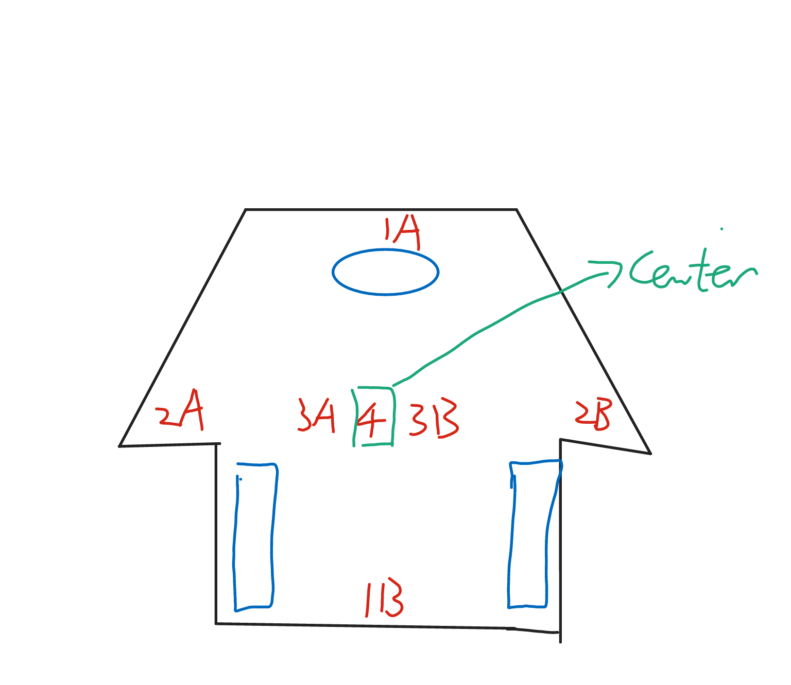

# 关于红外传感器

## 红外传感器布局（草拟）

- 危险处理
    - 根据小车的行进方向， 1A, 1B 有且仅有一个位于「前方」。当「前方」离开当前应该处于的颜色区域（下简称「出界」，应立即转向至少 90° 。
    - 当 2A 或 2B 「出界」，可根据行进状况采取相对温和的转向策略。
    - 当 3A 或 3B 「出界」，应采取激进的转向策略确保安全。

- 地图绘制
    - 结合 4 和上位机提供的位置信息，可直接进行地图绘制。
    - 一个想法：可否通过当前速度（未转向的情况下位置做差）方向，确定各个传感器的相对坐标？这样每个时刻可以得到至多 7 个单元的值；我们甚至可以添加更多的传感器。前提是知道一个单位坐标对应的确切物理尺寸（@地图组）。如果这样，是否还有必要先对地图进行完整的遍历？

参考资料:
- http://arcbotics.com/products/sparki/parts/infrared-reflectance-sensor/
